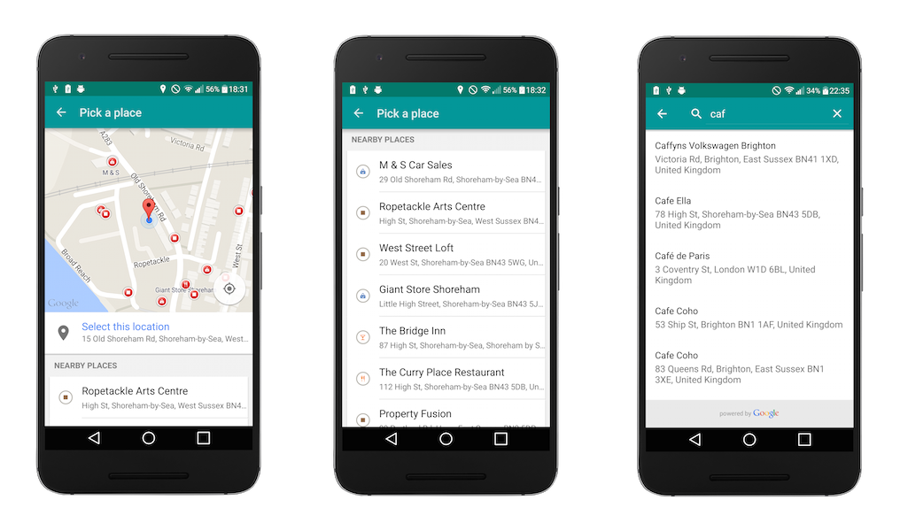

Pickr 
=====

    

A simple demo application that demonstrates the use of the Place Picker and Autocomplete functionality found within Google Play Services.

The project is setup using:

- Functional tests with [Espresso](https://code.google.com/p/android-test-kit/wiki/Espresso)
- Unit tests with [Robolectric](http://robolectric.org/)
- [Google Play Services](https://developers.google.com/android/guides/overview)
- [RxJava](https://github.com/ReactiveX/RxJava) and [RxAndroid](https://github.com/ReactiveX/RxAndroid) 
- [Retrofit](http://square.github.io/retrofit/) and [OkHttp](https://github.com/square/okhttp)
- [Dagger 2](http://google.github.io/dagger/)
- [SqlBrite](https://github.com/square/sqlbrite)
- [EasyAdapter](https://github.com/ribot/easy-adapter)
- [Butterknife](https://github.com/JakeWharton/butterknife)
- [Timber] (https://github.com/JakeWharton/timber)
- [Mockito](http://mockito.org/)

Requirements
------------

 - [Android SDK](http://developer.android.com/sdk/index.html).
 - Android [5.1 (API 23) ](http://developer.android.com/tools/revisions/platforms.html#5.1).
 - Android SDK Tools
 - Android SDK Build tools 23.0.1
 - Android Support library 23.0.1
 - Android Support Repository

Building
--------

To build, install and run a debug version, run this from the root of the project:

    ./gradlew installDebug
    
Testing
--------

For Android Studio to use syntax highlighting for Automated tests and Unit tests you **must** switch the Build Variant to the desired mode.

To run **unit** tests on your machine using [Robolectric] (http://robolectric.org/):

    ./gradlew testDebug
    
To run **automated** tests on connected devices:

    ./gradlew connectedAndroidTest